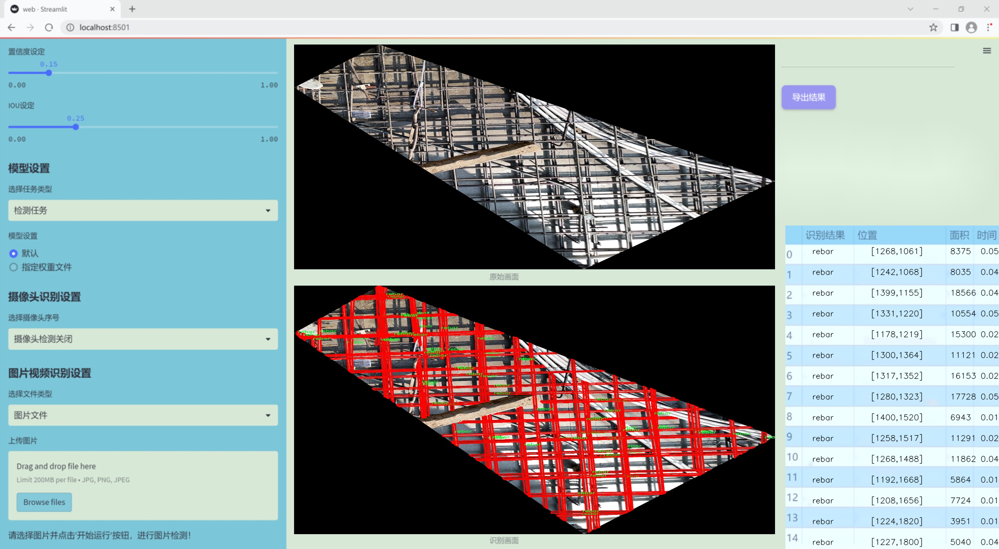
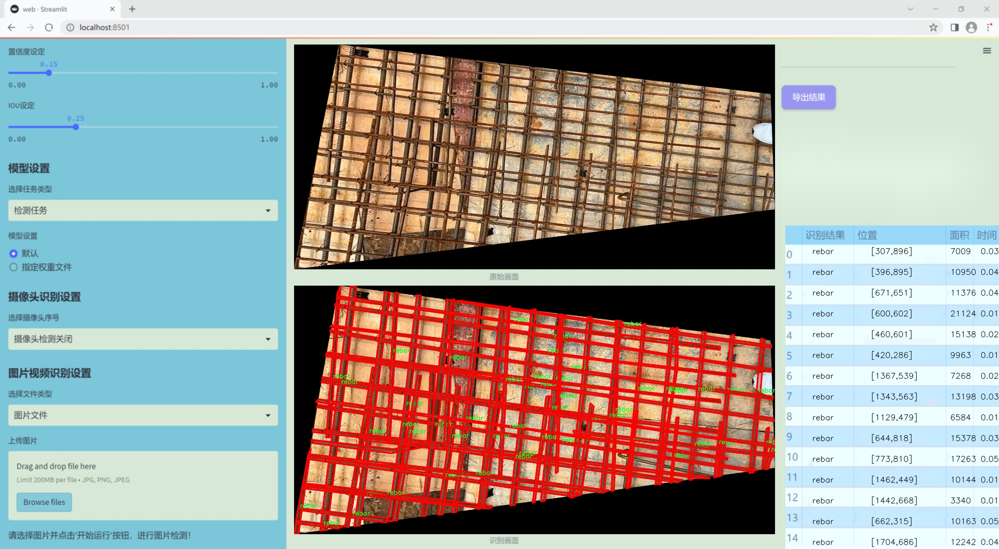
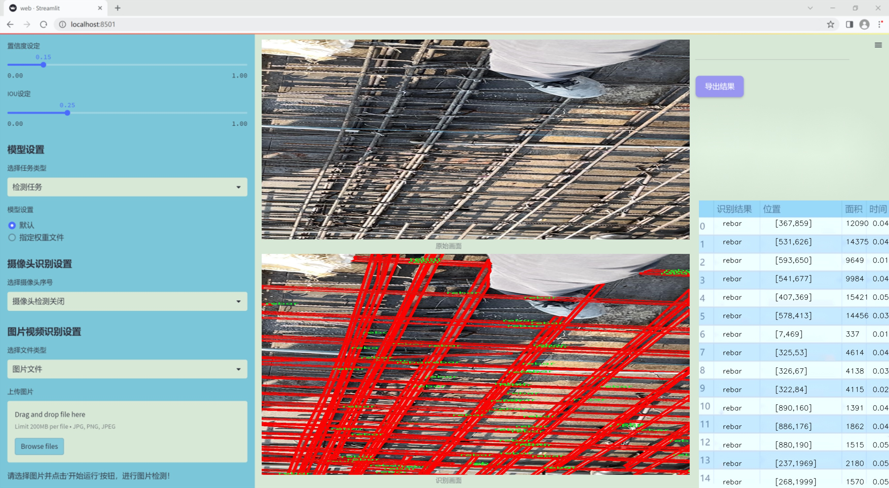
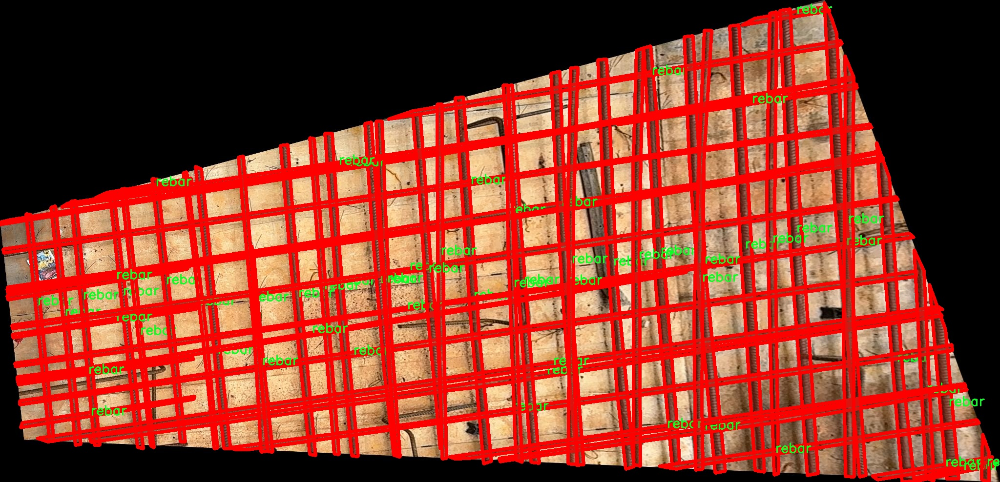
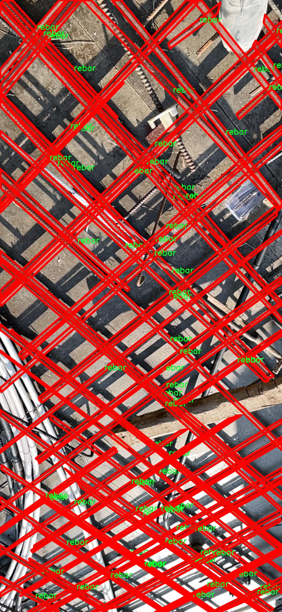
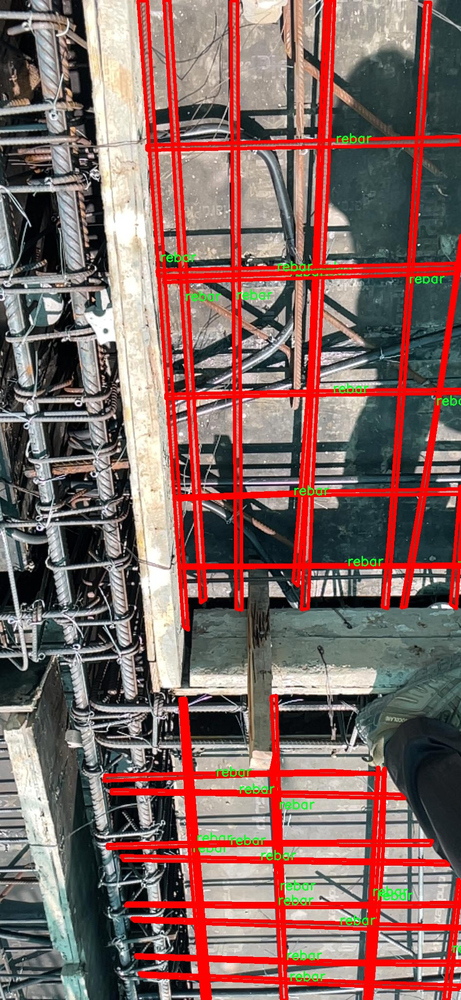
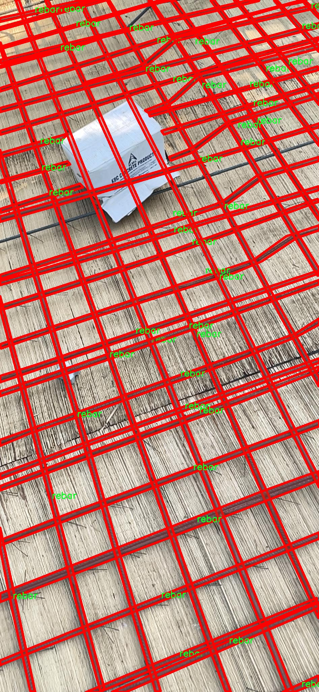
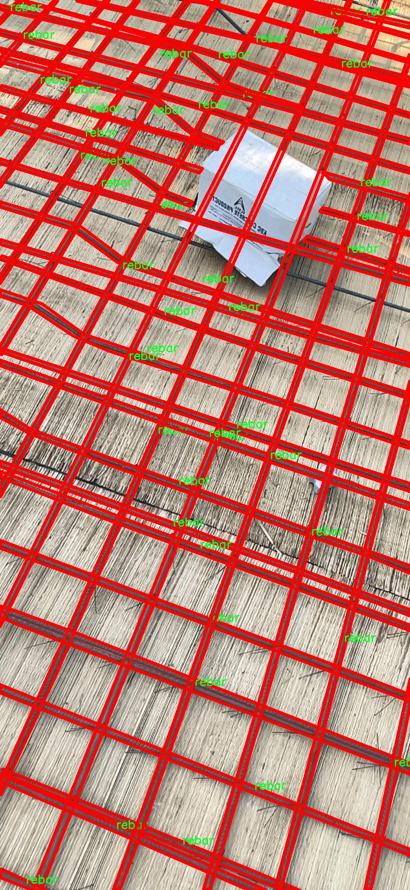

### 1.背景意义

研究背景与意义

随着建筑行业的快速发展，钢筋作为混凝土结构中不可或缺的组成部分，其质量和布置的准确性直接影响到建筑物的安全性和耐久性。因此，如何高效、准确地对钢筋进行检测和分割，成为了当前计算机视觉领域的重要研究课题。传统的钢筋检测方法往往依赖于人工检查，效率低下且容易受到人为因素的影响，难以满足现代建筑工程对精度和效率的要求。因此，基于深度学习的图像分割技术应运而生，为钢筋检测提供了新的解决方案。

在众多深度学习模型中，YOLO（You Only Look Once）系列因其实时性和高精度而受到广泛关注。YOLOv11作为该系列的最新版本，具备了更强的特征提取能力和更快的推理速度，能够在复杂的环境中实现对目标的精准定位和分割。通过对YOLOv11的改进，结合针对钢筋图像的特定需求，可以进一步提升其在钢筋检测中的应用效果。

本研究基于一个包含4475张钢筋图像的数据集，旨在构建一个高效的钢筋图像分割系统。该数据集专注于钢筋这一单一类别，经过精心标注和预处理，能够为模型的训练提供丰富的样本支持。通过数据增强技术的应用，进一步扩展了数据集的多样性，提高了模型的泛化能力。这一系统的开发不仅能够提升钢筋检测的自动化水平，还能为建筑行业提供更为可靠的技术支持，推动智能建筑的发展。

综上所述，基于改进YOLOv11的钢筋图像分割系统的研究，具有重要的理论价值和实际意义，能够为建筑行业的数字化转型提供有力的技术保障。

### 2.视频效果

[2.1 视频效果](https://www.bilibili.com/video/BV1Pym4YyETx/)

### 3.图片效果







##### [项目涉及的源码数据来源链接](https://kdocs.cn/l/cszuIiCKVNis)**

注意：本项目提供训练的数据集和训练教程,由于版本持续更新,暂不提供权重文件（best.pt）,请按照6.训练教程进行训练后实现上图演示的效果。

### 4.数据集信息

##### 4.1 本项目数据集类别数＆类别名

nc: 1
names: ['rebar']


该项目为【图像分割】数据集，请在【训练教程和Web端加载模型教程（第三步）】这一步的时候按照【图像分割】部分的教程来训练

##### 4.2 本项目数据集信息介绍

本项目数据集信息介绍

本项目旨在改进YOLOv11的钢筋图像分割系统，所使用的数据集名为“Rebar_phase4”。该数据集专注于钢筋的检测与分割，特别适用于在建筑和工程领域中对钢筋的自动识别与分析。数据集中包含的类别数量为1，具体类别为“rebar”，即钢筋。这一类别的设定反映了项目的核心目标，即通过深度学习技术对钢筋进行精准的图像分割，以提高相关领域的工作效率和安全性。

“Rebar_phase4”数据集的构建经过精心设计，涵盖了多种场景下的钢筋图像，确保了数据的多样性和代表性。数据集中包含的图像不仅涵盖了不同角度、不同光照条件下的钢筋，还包括了不同类型和规格的钢筋。这种多样性使得模型在训练过程中能够学习到更为丰富的特征，从而提高其在实际应用中的鲁棒性和准确性。

此外，数据集中的图像经过专业标注，确保每一幅图像中的钢筋都被准确地框定和标识。这种高质量的标注为模型的训练提供了可靠的基础，能够有效减少误检和漏检的情况。在训练过程中，改进后的YOLOv11将利用这一数据集进行特征学习，以实现对钢筋的快速而准确的分割。

通过对“Rebar_phase4”数据集的深入分析与应用，本项目不仅希望提升钢筋图像分割的技术水平，更希望为建筑行业的智能化发展贡献一份力量。最终，期望通过这一改进的系统，能够实现钢筋检测的自动化，降低人工成本，提高工作效率，并在一定程度上提升建筑工程的安全性。











### 5.全套项目环境部署视频教程（零基础手把手教学）

[5.1 所需软件PyCharm和Anaconda安装教程（第一步）](https://www.bilibili.com/video/BV1BoC1YCEKi/?spm_id_from=333.999.0.0&vd_source=bc9aec86d164b67a7004b996143742dc)


[5.2 安装Python虚拟环境创建和依赖库安装视频教程（第二步）](https://www.bilibili.com/video/BV1ZoC1YCEBw?spm_id_from=333.788.videopod.sections&vd_source=bc9aec86d164b67a7004b996143742dc)

### 6.改进YOLOv11训练教程和Web_UI前端加载模型教程（零基础手把手教学）

[6.1 改进YOLOv11训练教程和Web_UI前端加载模型教程（第三步）](https://www.bilibili.com/video/BV1BoC1YCEhR?spm_id_from=333.788.videopod.sections&vd_source=bc9aec86d164b67a7004b996143742dc)


按照上面的训练视频教程链接加载项目提供的数据集，运行train.py即可开始训练



     Epoch   gpu_mem       box       obj       cls    labels  img_size
     1/200     20.8G   0.01576   0.01955  0.007536        22      1280: 100%|██████████| 849/849 [14:42<00:00,  1.04s/it]
               Class     Images     Labels          P          R     mAP@.5 mAP@.5:.95: 100%|██████████| 213/213 [01:14<00:00,  2.87it/s]
                 all       3395      17314      0.994      0.957      0.0957      0.0843

     Epoch   gpu_mem       box       obj       cls    labels  img_size
     2/200     20.8G   0.01578   0.01923  0.007006        22      1280: 100%|██████████| 849/849 [14:44<00:00,  1.04s/it]
               Class     Images     Labels          P          R     mAP@.5 mAP@.5:.95: 100%|██████████| 213/213 [01:12<00:00,  2.95it/s]
                 all       3395      17314      0.996      0.956      0.0957      0.0845

     Epoch   gpu_mem       box       obj       cls    labels  img_size
     3/200     20.8G   0.01561    0.0191  0.006895        27      1280: 100%|██████████| 849/849 [10:56<00:00,  1.29it/s]
               Class     Images     Labels          P          R     mAP@.5 mAP@.5:.95: 100%|███████   | 187/213 [00:52<00:00,  4.04it/s]
                 all       3395      17314      0.996      0.957      0.0957      0.0845


###### [项目数据集下载链接](https://kdocs.cn/l/cszuIiCKVNis)

### 7.原始YOLOv11算法讲解


##### YOLO11介绍

Ultralytics YOLO11是一款尖端的、最先进的模型，它在之前YOLO版本成功的基础上进行了构建，并引入了新功能和改进，以进一步提升性能和灵活性。
**YOLO11设计快速、准确且易于使用，使其成为各种物体检测和跟踪、实例分割、图像分类以及姿态估计任务的绝佳选择。**


**结构图如下：**


##### **C3k2**

**C3k2，结构图如下**


**C3k2，继承自类`C2f，其中通过c3k设置False或者Ture来决定选择使用C3k还是`**Bottleneck


**实现代码** **ultralytics/nn/modules/block.py**

##### C2PSA介绍

**借鉴V10 PSA结构，实现了C2PSA和C2fPSA，最终选择了基于C2的C2PSA（可能涨点更好？）**


**实现代码** **ultralytics/nn/modules/block.py**

##### Detect介绍

**分类检测头引入了DWConv（更加轻量级，为后续二次创新提供了改进点），结构图如下（和V8的区别）：**


### 8.200+种全套改进YOLOV11创新点原理讲解

#### 8.1 200+种全套改进YOLOV11创新点原理讲解大全

由于篇幅限制，每个创新点的具体原理讲解就不全部展开，具体见下列网址中的改进模块对应项目的技术原理博客网址【Blog】（创新点均为模块化搭建，原理适配YOLOv5~YOLOv11等各种版本）

[改进模块技术原理博客【Blog】网址链接](https://gitee.com/qunmasj/good)


#### 8.2 精选部分改进YOLOV11创新点原理讲解

###### 这里节选部分改进创新点展开原理讲解(完整的改进原理见上图和[改进模块技术原理博客链接](https://gitee.com/qunmasj/good)【如果此小节的图加载失败可以通过CSDN或者Github搜索该博客的标题访问原始博客，原始博客图片显示正常】



### 视觉transformer(ViT)简介
视觉transformer(ViT)最近在各种计算机视觉任务中证明了巨大的成功，并受到了相当多的关注。与卷积神经网络(CNNs)相比，ViT具有更强的全局信息捕获能力和远程交互能力，表现出优于CNNs的准确性，特别是在扩大训练数据大小和模型大小时[An image is worth 16x16 words: Transformers for image recognition at scale,Coatnet]。

尽管ViT在低分辨率和高计算领域取得了巨大成功，但在高分辨率和低计算场景下，ViT仍不如cnn。例如，下图(左)比较了COCO数据集上当前基于cnn和基于vit的一级检测器。基于vit的检测器(160G mac)和基于cnn的检测器(6G mac)之间的效率差距超过一个数量级。这阻碍了在边缘设备的实时高分辨率视觉应用程序上部署ViT。


左图:现有的基于vit的一级检测器在实时目标检测方面仍然不如当前基于cnn的一级检测器，需要的计算量多出一个数量级。本文引入了第一个基于vit的实时对象检测器来弥补这一差距。在COCO上，efficientvit的AP比efficientdet高3.8，而mac较低。与YoloX相比，efficient ViT节省67.2%的计算成本，同时提供更高的AP。

中:随着输入分辨率的增加，计算成本呈二次增长，无法有效处理高分辨率的视觉应用。

右图:高分辨率对图像分割很重要。当输入分辨率从1024x2048降低到512x1024时，MobileNetV2的mIoU减少12% (8.5 mIoU)。在不提高分辨率的情况下，只提高模型尺寸是无法缩小性能差距的。

ViT的根本计算瓶颈是softmax注意模块，其计算成本随输入分辨率的增加呈二次增长。例如，如上图(中)所示，随着输入分辨率的增加，vit- small[Pytorch image models. https://github.com/rwightman/ pytorch-image-models]的计算成本迅速显著大于ResNet-152的计算成本。

解决这个问题的一个直接方法是降低输入分辨率。然而，高分辨率的视觉识别在许多现实世界的计算机视觉应用中是必不可少的，如自动驾驶，医疗图像处理等。当输入分辨率降低时，图像中的小物体和精细细节会消失，导致目标检测和语义分割性能显著下降。

上图(右)显示了在cityscape数据集上不同输入分辨率和宽度乘法器下MobileNetV2的性能。例如，将输入分辨率从1024x2048降低到512x1024会使cityscape的性能降低12% (8.5 mIoU)。即使是3.6倍高的mac，只放大模型尺寸而不增加分辨率也无法弥补这一性能损失。

除了降低分辨率外，另一种代表性的方法是限制softmax注意，方法是将其范围限制在固定大小的局部窗口内[Swin transformer,Swin transformer v2]或降低键/值张量的维数[Pyramid vision transformer,Segformer]。然而，它损害了ViT的非局部注意能力，降低了全局接受域(ViT最重要的优点)，使得ViT与大内核cnn的区别更小[A convnet for the 2020s,Scaling up your kernels to 31x31: Revisiting large kernel design in cnns,Lite pose: Efficient architecture design for 2d human pose estimation]。

本文介绍了一个有效的ViT体系结构，以解决这些挑战。发现没有必要坚持softmax注意力。本文建议用线性注意[Transformers are rnns: Fast autoregressive transformers with linear attention]代替softmax注意。

线性注意的关键好处是，它保持了完整的n 2 n^2n 2
 注意映射，就像softmax注意。同时，它利用矩阵乘法的联想特性，避免显式计算完整的注意映射，同时保持相同的功能。因此，它保持了softmax注意力的全局特征提取能力，且计算复杂度仅为线性。线性注意的另一个关键优点是它避免了softmax，这使得它在移动设备上更有效(下图左)。


左图:线性注意比类似mac下的softmax注意快3.3-4.5倍，这是因为去掉了硬件效率不高的softmax功能。延迟是在Qualcomm Snapdragon 855 CPU和TensorFlow-Lite上测量的。本文增加线性注意的头部数量，以确保它具有与softmax注意相似的mac。

中:然而，如果没有softmax注意中使用的非线性注意评分归一化，线性注意无法有效集中其注意分布，削弱了其局部特征提取能力。后文提供了可视化。

右图:本文用深度卷积增强线性注意，以解决线性注意的局限性。深度卷积可以有效地捕捉局部特征，而线性注意可以专注于捕捉全局信息。增强的线性注意在保持线性注意的效率和简单性的同时，表现出在各种视觉任务上的强大表现(图4)。

然而，直接应用线性注意也有缺点。以往的研究表明线性注意和softmax注意之间存在显著的性能差距(下图中间)。


左:高通骁龙855上的精度和延迟权衡。效率vit比效率网快3倍，精度更高。中:ImageNet上softmax注意与线性注意的比较。在相同的计算条件下，本文观察到softmax注意与线性注意之间存在显著的精度差距。而深度卷积增强模型后，线性注意的精度有明显提高。

相比之下，softmax注意的精度变化不大。在相同MAC约束下，增强线性注意比增强软最大注意提高了0.3%的精度。右图:与增强的softmax注意相比，增强的线性注意硬件效率更高，随着分辨率的增加，延迟增长更慢。

深入研究线性注意和softmax注意的详细公式，一个关键的区别是线性注意缺乏非线性注意评分归一化方案。这使得线性注意无法有效地将注意力分布集中在局部模式产生的高注意分数上，从而削弱了其局部特征提取能力。

本文认为这是线性注意的主要限制，使其性能不如softmax注意。本文提出了一个简单而有效的解决方案来解决这一限制，同时保持线性注意在低复杂度和低硬件延迟方面的优势。具体来说，本文建议通过在每个FFN层中插入额外的深度卷积来增强线性注意。因此，本文不需要依赖线性注意进行局部特征提取，避免了线性注意在捕捉局部特征方面的不足，并利用了线性注意在捕捉全局特征方面的优势。

本文广泛评估了efficient vit在低计算预算下对各种视觉任务的有效性，包括COCO对象检测、城市景观语义分割和ImageNet分类。本文想要突出高效的主干设计，所以没有包括任何正交的附加技术(例如，知识蒸馏，神经架构搜索)。尽管如此，在COCO val2017上，efficientvit的AP比efficientdet - d1高2.4倍，同时节省27.9%的计算成本。在cityscape上，efficientvit提供了比SegFormer高2.5个mIoU，同时降低了69.6%的计算成本。在ImageNet上，efficientvit在584M mac上实现了79.7%的top1精度，优于efficientnet - b1的精度，同时节省了16.6%的计算成本。

与现有的以减少参数大小或mac为目标的移动ViT模型[Mobile-former,Mobilevit,NASVit]不同，本文的目标是减少移动设备上的延迟。本文的模型不涉及复杂的依赖或硬件低效操作。因此，本文减少的计算成本可以很容易地转化为移动设备上的延迟减少。

在高通骁龙855 CPU上，efficient vit运行速度比efficientnet快3倍，同时提供更高的ImageNet精度。本文的代码和预训练的模型将在出版后向公众发布。

### Efficient Vision Transformer.
提高ViT的效率对于在资源受限的边缘平台上部署ViT至关重要，如手机、物联网设备等。尽管ViT在高计算区域提供了令人印象深刻的性能，但在针对低计算区域时，它通常不如以前高效的cnn[Efficientnet, mobilenetv3,Once for all: Train one network and specialize it for efficient deployment]。为了缩小差距，MobileViT建议结合CNN和ViT的长处，使用transformer将卷积中的局部处理替换为全局处理。MobileFormer提出了在MobileNet和Transformer之间建立双向桥以实现特征融合的并行化。NASViT提出利用神经架构搜索来搜索高效的ViT架构。

这些模型在ImageNet上提供了极具竞争力的准确性和效率的权衡。然而，它们并不适合高分辨率的视觉任务，因为它们仍然依赖于softmax注意力。


在本节中，本文首先回顾了自然语言处理中的线性注意，并讨论了它的优缺点。接下来，本文介绍了一个简单而有效的解决方案来克服线性注意的局限性。最后，给出了efficient vit的详细架构。

 为可学习投影矩阵。Oi表示矩阵O的第i行。Sim(·，·)为相似度函数。

虽然softmax注意力在视觉和NLP方面非常成功，但它并不是唯一的选择。例如，线性注意提出了如下相似度函数:


其中，φ(·)为核函数。在本工作中，本文选择了ReLU作为内核函数，因为它对硬件来说是友好的。当Sim(Q, K) = φ(Q)φ(K)T时，式(1)可改写为:


线性注意的一个关键优点是，它允许利用矩阵乘法的结合律，在不改变功能的情况下，将计算复杂度从二次型降低到线性型:


除了线性复杂度之外，线性注意的另一个关键优点是它不涉及注意模块中的softmax。Softmax在硬件上效率非常低。避免它可以显著减少延迟。例如，下图(左)显示了softmax注意和线性注意之间的延迟比较。在类似的mac上，线性注意力比移动设备上的softmax注意力要快得多。


#### EfficientViT
Enhancing Linear Attention with Depthwise Convolution

虽然线性注意在计算复杂度和硬件延迟方面优于softmax注意，但线性注意也有局限性。以往的研究[\[Luna: Linear unified nested attention,Random feature attention,Combiner: Full attention transformer with sparse computation cost,cosformer: Rethinking softmax in attention\]](https://afdian.net/item/602b9612927111ee9ec55254001e7c00)表明，在NLP中线性注意和softmax注意之间通常存在显著的性能差距。对于视觉任务，之前的研究[Visual correspondence hallucination,Quadtree attention for vision transformers]也表明线性注意不如softmax注意。在本文的实验中，本文也有类似的观察结果(图中)。


本文对这一假设提出了质疑，认为线性注意的低劣性能主要是由于局部特征提取能力的丧失。如果没有在softmax注意中使用的非线性评分归一化，线性注意很难像softmax注意那样集中其注意分布。下图(中间)提供了这种差异的示例。


在相同的原始注意力得分下，使用softmax比不使用softmax更能集中注意力。因此，线性注意不能有效地聚焦于局部模式产生的高注意分数(下图)，削弱了其局部特征提取能力。


注意图的可视化显示了线性注意的局限性。通过非线性注意归一化，softmax注意可以产生清晰的注意分布，如中间行所示。相比之下，线性注意的分布相对平滑，使得线性注意在捕捉局部细节方面的能力较弱，造成了显著的精度损失。本文通过深度卷积增强线性注意来解决这一限制，并有效提高了准确性。

介绍了一个简单而有效的解决方案来解决这个限制。本文的想法是用卷积增强线性注意，这在局部特征提取中是非常有效的。这样，本文就不需要依赖于线性注意来捕捉局部特征，而可以专注于全局特征提取。具体来说，为了保持线性注意的效率和简单性，本文建议在每个FFN层中插入一个深度卷积，这样计算开销很小，同时极大地提高了线性注意的局部特征提取能力。

#### Building Block

下图(右)展示了增强线性注意的详细架构，它包括一个线性注意层和一个FFN层，在FFN的中间插入深度卷积。


与之前的方法[Swin transformer,Coatnet]不同，本文在efficientvit中没有使用相对位置偏差。相对位置偏差虽然可以改善模型的性能，但它使模型容易受到分辨率变化[Segformer]的影响。多分辨率训练或新分辨率下的测试在检测和分割中很常见。去除相对位置偏差使高效率vit对输入分辨率更加灵活。

与之前低计算CNNs[Mobilenetv2,mobilenetv3]的设计不同，本文为下采样块添加了额外的下采样快捷方式。每个下采样快捷方式由一个平均池和一个1x1卷积组成。在本文的实验中，这些额外的下采样快捷方式可以稳定训练效率，提高性能。

#### Macro Architecture

下图说明了efficientvit的宏观体系结构。它由输入 stem 和4级组成。最近的研究[Coatnet,Levit,Early convolutions help transformers see better]表明在早期阶段使用卷积对ViT更好。本文遵循这个设计，在第三阶段开始使用增强的线性注意。


EfficientViT宏观架构。本文从第三阶段开始使用增强的线性注意。P2、P3和P4形成了一个金字塔特征图，用于检测和分割。P4用于分类。

为了突出高效的主干本身，本文对MBConv和FFN使用相同的扩展比e (e = 4)保持超参数简单，对所有深度卷积使用相同的内核大小k(除了输入stem)，对所有层使用相同的激活函数(hard swish)。

P2、P3和P4表示阶段2、3和4的输出，形成了特征图的金字塔。本文按照惯例将P2、P3和P4送至检测头。本文使用Yolov8进行检测。为了分割，本文融合了P2和P4。融合特征被馈送到一个轻量级头，包括几个卷积层，遵循Fast-SCNN。为了分类，本文将P4输入到轻量级头部，与MobileNetV3相同。


### 9.系统功能展示

图9.1.系统支持检测结果表格显示

  图9.2.系统支持置信度和IOU阈值手动调节

  图9.3.系统支持自定义加载权重文件best.pt(需要你通过步骤5中训练获得)

  图9.4.系统支持摄像头实时识别

  图9.5.系统支持图片识别

  图9.6.系统支持视频识别

  图9.7.系统支持识别结果文件自动保存

  图9.8.系统支持Excel导出检测结果数据


### 10. YOLOv11核心改进源码讲解

#### 10.1 fadc.py

以下是对给定代码的核心部分进行分析和详细注释的结果。代码主要包含了自适应膨胀卷积（Adaptive Dilated Convolution）和频率选择（Frequency Selection）等模块。

```python
import torch
import torch.nn as nn
import torch.nn.functional as F

class OmniAttention(nn.Module):
    def __init__(self, in_planes, out_planes, kernel_size, groups=1, reduction=0.0625, kernel_num=4, min_channel=16):
        super(OmniAttention, self).__init__()
        # 计算注意力通道数
        attention_channel = max(int(in_planes * reduction), min_channel)
        self.kernel_size = kernel_size
        self.kernel_num = kernel_num
        self.temperature = 1.0  # 温度参数，用于控制注意力的平滑程度

        # 定义层
        self.avgpool = nn.AdaptiveAvgPool2d(1)  # 自适应平均池化
        self.fc = nn.Conv2d(in_planes, attention_channel, 1, bias=False)  # 全连接层
        self.bn = nn.BatchNorm2d(attention_channel)  # 批归一化
        self.relu = nn.ReLU(inplace=True)  # ReLU激活函数

        # 定义通道、过滤器、空间和内核注意力的全连接层
        self.channel_fc = nn.Conv2d(attention_channel, in_planes, 1, bias=True)
        self.func_channel = self.get_channel_attention

        if in_planes == groups and in_planes == out_planes:  # 深度卷积
            self.func_filter = self.skip
        else:
            self.filter_fc = nn.Conv2d(attention_channel, out_planes, 1, bias=True)
            self.func_filter = self.get_filter_attention

        if kernel_size == 1:  # 点卷积
            self.func_spatial = self.skip
        else:
            self.spatial_fc = nn.Conv2d(attention_channel, kernel_size * kernel_size, 1, bias=True)
            self.func_spatial = self.get_spatial_attention

        if kernel_num == 1:
            self.func_kernel = self.skip
        else:
            self.kernel_fc = nn.Conv2d(attention_channel, kernel_num, 1, bias=True)
            self.func_kernel = self.get_kernel_attention

        self._initialize_weights()  # 初始化权重

    def _initialize_weights(self):
        # 权重初始化
        for m in self.modules():
            if isinstance(m, nn.Conv2d):
                nn.init.kaiming_normal_(m.weight, mode='fan_out', nonlinearity='relu')
                if m.bias is not None:
                    nn.init.constant_(m.bias, 0)
            if isinstance(m, nn.BatchNorm2d):
                nn.init.constant_(m.weight, 1)
                nn.init.constant_(m.bias, 0)

    @staticmethod
    def skip(_):
        return 1.0  # 跳过操作，返回1.0

    def get_channel_attention(self, x):
        # 计算通道注意力
        channel_attention = torch.sigmoid(self.channel_fc(x).view(x.size(0), -1, 1, 1) / self.temperature)
        return channel_attention

    def get_filter_attention(self, x):
        # 计算过滤器注意力
        filter_attention = torch.sigmoid(self.filter_fc(x).view(x.size(0), -1, 1, 1) / self.temperature)
        return filter_attention

    def get_spatial_attention(self, x):
        # 计算空间注意力
        spatial_attention = self.spatial_fc(x).view(x.size(0), 1, 1, 1, self.kernel_size, self.kernel_size)
        spatial_attention = torch.sigmoid(spatial_attention / self.temperature)
        return spatial_attention

    def get_kernel_attention(self, x):
        # 计算内核注意力
        kernel_attention = self.kernel_fc(x).view(x.size(0), -1, 1, 1, 1, 1)
        kernel_attention = F.softmax(kernel_attention / self.temperature, dim=1)
        return kernel_attention

    def forward(self, x):
        # 前向传播
        x = self.avgpool(x)  # 自适应平均池化
        x = self.fc(x)  # 全连接层
        x = self.bn(x)  # 批归一化
        x = self.relu(x)  # ReLU激活
        return self.func_channel(x), self.func_filter(x), self.func_spatial(x), self.func_kernel(x)

def generate_laplacian_pyramid(input_tensor, num_levels, size_align=True, mode='bilinear'):
    # 生成拉普拉斯金字塔
    pyramid = []
    current_tensor = input_tensor
    _, _, H, W = current_tensor.shape
    for _ in range(num_levels):
        b, _, h, w = current_tensor.shape
        downsampled_tensor = F.interpolate(current_tensor, (h//2 + h%2, w//2 + w%2), mode=mode, align_corners=(H%2) == 1)
        if size_align: 
            upsampled_tensor = F.interpolate(downsampled_tensor, (H, W), mode=mode, align_corners=(H%2) == 1)
            laplacian = F.interpolate(current_tensor, (H, W), mode=mode, align_corners=(H%2) == 1) - upsampled_tensor
        else:
            upsampled_tensor = F.interpolate(downsampled_tensor, (h, w), mode=mode, align_corners=(H%2) == 1)
            laplacian = current_tensor - upsampled_tensor
        pyramid.append(laplacian)
        current_tensor = downsampled_tensor
    if size_align: current_tensor = F.interpolate(current_tensor, (H, W), mode=mode, align_corners=(H%2) == 1)
    pyramid.append(current_tensor)
    return pyramid

class FrequencySelection(nn.Module):
    def __init__(self, in_channels, k_list=[2], lowfreq_att=True, fs_feat='feat', lp_type='freq', act='sigmoid', spatial='conv', spatial_group=1):
        super().__init__()
        self.k_list = k_list  # 频率列表
        self.lp_list = nn.ModuleList()  # 拉普拉斯金字塔列表
        self.freq_weight_conv_list = nn.ModuleList()  # 频率权重卷积列表
        self.fs_feat = fs_feat  # 特征选择
        self.lp_type = lp_type  # 拉普拉斯金字塔类型
        self.in_channels = in_channels  # 输入通道数
        self.spatial_group = spatial_group  # 空间分组
        self.lowfreq_att = lowfreq_att  # 低频注意力

        # 定义频率权重卷积
        if spatial == 'conv':
            for i in range(len(k_list) + (1 if lowfreq_att else 0)):
                freq_weight_conv = nn.Conv2d(in_channels=in_channels, out_channels=self.spatial_group, kernel_size=3, groups=self.spatial_group, padding=1, bias=True)
                self.freq_weight_conv_list.append(freq_weight_conv)

        # 定义拉普拉斯金字塔
        if self.lp_type == 'avgpool':
            for k in k_list:
                self.lp_list.append(nn.Sequential(
                    nn.ReplicationPad2d(padding=k // 2),
                    nn.AvgPool2d(kernel_size=k, padding=0, stride=1)
                ))
        else:
            raise NotImplementedError

    def sp_act(self, freq_weight):
        # 应用激活函数
        if self.act == 'sigmoid':
            freq_weight = freq_weight.sigmoid() * 2
        elif self.act == 'softmax':
            freq_weight = freq_weight.softmax(dim=1) * freq_weight.shape[1]
        else:
            raise NotImplementedError
        return freq_weight

    def forward(self, x, att_feat=None):
        # 前向传播
        if att_feat is None: att_feat = x
        x_list = []
        if self.lp_type == 'avgpool':
            pre_x = x
            b, _, h, w = x.shape
            for idx, avg in enumerate(self.lp_list):
                low_part = avg(x)  # 低频部分
                high_part = pre_x - low_part  # 高频部分
                pre_x = low_part
                freq_weight = self.freq_weight_conv_list[idx](att_feat)  # 频率权重
                freq_weight = self.sp_act(freq_weight)  # 应用激活函数
                x_list.append(freq_weight.reshape(b, self.spatial_group, -1, h, w) * high_part.reshape(b, self.spatial_group, -1, h, w))
            if self.lowfreq_att:
                freq_weight = self.freq_weight_conv_list[len(x_list)](att_feat)
                x_list.append(freq_weight.reshape(b, self.spatial_group, -1, h, w) * pre_x.reshape(b, self.spatial_group, -1, h, w))
            else:
                x_list.append(pre_x)
        x = sum(x_list)  # 合并结果
        return x

class AdaptiveDilatedConv(nn.Module):
    """自适应膨胀卷积类"""
    def __init__(self, in_channels, out_channels, kernel_size, stride=1, padding=0, dilation=1, groups=1, bias=True):
        super(AdaptiveDilatedConv, self).__init__()
        self.conv = nn.Conv2d(in_channels, out_channels, kernel_size, stride=stride, padding=padding, dilation=dilation, groups=groups, bias=bias)

    def forward(self, x):
        # 前向传播
        return self.conv(x)  # 直接调用卷积层

# 其他类如 AdaptiveDilatedDWConv 省略，结构类似
```

### 代码核心部分说明：
1. **OmniAttention**: 该类实现了多种注意力机制，包括通道注意力、过滤器注意力、空间注意力和内核注意力。通过自适应平均池化和全连接层来计算注意力权重。

2. **generate_laplacian_pyramid**: 该函数生成拉普拉斯金字塔，用于图像的多尺度分析。

3. **FrequencySelection**: 该类实现了频率选择机制，通过卷积和激活函数选择不同频率的特征。

4. **AdaptiveDilatedConv**: 该类实现了自适应膨胀卷积，主要用于处理图像特征。

这些核心部分结合在一起，可以用于构建更复杂的神经网络模型，特别是在图像处理和计算机视觉任务中。

这个文件 `fadc.py` 实现了一些用于深度学习的自适应膨胀卷积和频率选择模块，主要使用 PyTorch 框架。文件中包含多个类和函数，以下是对这些内容的逐一分析和说明。

首先，文件导入了必要的库，包括 PyTorch 和 NumPy。接着，尝试从 `mmcv` 库中导入 `ModulatedDeformConv2d` 和 `modulated_deform_conv2d`，如果导入失败，则将 `ModulatedDeformConv2d` 设置为 `nn.Module` 的一个简单替代。

接下来定义了 `OmniAttention` 类，这是一个实现全局注意力机制的模块。它的构造函数接收多个参数，包括输入和输出通道数、卷积核大小、组数、缩减比例等。该类主要用于计算通道注意力、过滤器注意力、空间注意力和卷积核注意力。它通过自适应平均池化、全连接层和卷积层来实现这些功能，并在前向传播中计算出注意力权重。

`generate_laplacian_pyramid` 函数用于生成拉普拉斯金字塔，这是一种图像处理技术，通常用于多尺度图像分析。该函数通过逐层下采样输入张量，并计算当前层与下采样后上采样的差异来生成金字塔。

`FrequencySelection` 类实现了频率选择机制，允许对输入特征进行频率域的处理。该类的构造函数接收多个参数，包括输入通道数、频率列表、空间卷积的配置等。它通过平均池化或拉普拉斯金字塔来处理输入，并结合频率权重卷积来实现特征选择。

`AdaptiveDilatedConv` 类是一个自适应膨胀卷积的实现，继承自 `ModulatedDeformConv2d`。它的构造函数中定义了卷积的偏移量、掩码和频率选择模块。该类的前向传播方法实现了带有自适应权重的变形卷积操作，能够根据输入特征动态调整卷积核的形状和位置。

`AdaptiveDilatedDWConv` 类是一个适应性膨胀深度卷积的实现，类似于 `AdaptiveDilatedConv`，但它专门用于深度卷积（即每个输入通道使用独立的卷积核）。该类同样实现了频率选择和注意力机制，并在前向传播中结合了深度卷积和自适应权重。

整个文件的设计旨在提供一种灵活的卷积操作，能够根据输入特征的不同动态调整卷积核的形状和权重，从而提高模型在图像处理任务中的表现。通过结合注意力机制和频率选择，模型能够更好地捕捉图像中的重要特征。

#### 10.2 kacn_conv.py

以下是经过简化和注释的核心代码部分：

```python
import torch
import torch.nn as nn

class KACNConvNDLayer(nn.Module):
    def __init__(self, conv_class, norm_class, input_dim, output_dim, degree, kernel_size,
                 groups=1, padding=0, stride=1, dilation=1,
                 ndim: int = 2, dropout=0.0):
        super(KACNConvNDLayer, self).__init__()
        
        # 初始化输入和输出维度、卷积参数等
        self.inputdim = input_dim
        self.outdim = output_dim
        self.degree = degree
        self.kernel_size = kernel_size
        self.padding = padding
        self.stride = stride
        self.dilation = dilation
        self.groups = groups
        self.ndim = ndim
        
        # 初始化dropout层
        self.dropout = None
        if dropout > 0:
            if ndim == 1:
                self.dropout = nn.Dropout1d(p=dropout)
            elif ndim == 2:
                self.dropout = nn.Dropout2d(p=dropout)
            elif ndim == 3:
                self.dropout = nn.Dropout3d(p=dropout)

        # 检查groups参数的有效性
        if groups <= 0:
            raise ValueError('groups must be a positive integer')
        if input_dim % groups != 0:
            raise ValueError('input_dim must be divisible by groups')
        if output_dim % groups != 0:
            raise ValueError('output_dim must be divisible by groups')

        # 为每个组创建归一化层
        self.layer_norm = nn.ModuleList([norm_class(output_dim // groups) for _ in range(groups)])

        # 创建多项式卷积层
        self.poly_conv = nn.ModuleList([conv_class((degree + 1) * input_dim // groups,
                                                   output_dim // groups,
                                                   kernel_size,
                                                   stride,
                                                   padding,
                                                   dilation,
                                                   groups=1,
                                                   bias=False) for _ in range(groups)])
        
        # 注册一个缓冲区用于多项式计算
        arange_buffer_size = (1, 1, -1,) + tuple(1 for _ in range(ndim))
        self.register_buffer("arange", torch.arange(0, degree + 1, 1).view(*arange_buffer_size))
        
        # 使用Kaiming均匀分布初始化卷积层权重
        for conv_layer in self.poly_conv:
            nn.init.normal_(conv_layer.weight, mean=0.0, std=1 / (input_dim * (degree + 1) * kernel_size ** ndim))

    def forward_kacn(self, x, group_index):
        # 对输入应用激活函数并进行线性变换
        x = torch.tanh(x)  # 应用tanh激活函数
        x = x.acos().unsqueeze(2)  # 计算反余弦并增加维度
        x = (x * self.arange).flatten(1, 2)  # 与arange相乘并展平
        x = x.cos()  # 计算余弦
        x = self.poly_conv[group_index](x)  # 通过多项式卷积层
        x = self.layer_norm[group_index](x)  # 归一化
        if self.dropout is not None:
            x = self.dropout(x)  # 应用dropout
        return x

    def forward(self, x):
        # 将输入分割为多个组并分别处理
        split_x = torch.split(x, self.inputdim // self.groups, dim=1)
        output = []
        for group_ind, _x in enumerate(split_x):
            y = self.forward_kacn(_x.clone(), group_ind)  # 处理每个组
            output.append(y.clone())
        y = torch.cat(output, dim=1)  # 合并输出
        return y
```

### 代码注释说明：
1. **类的初始化**：构造函数中初始化了输入输出维度、卷积参数、dropout层等，并检查了参数的有效性。
2. **层的创建**：使用`ModuleList`创建了归一化层和多项式卷积层，便于在前向传播中使用。
3. **权重初始化**：使用Kaiming均匀分布初始化卷积层的权重，以便于更好的训练开始。
4. **前向传播**：`forward_kacn`方法实现了对输入的处理，包括激活、变换、卷积和归一化；`forward`方法则将输入分割成多个组并调用`forward_kacn`进行处理，最后合并输出。

这个程序文件定义了一个名为 `kacn_conv.py` 的深度学习模块，主要用于实现一种新的卷积层，称为 KACN（KACN Convolutional Layer）。该模块基于 PyTorch 框架，使用了面向对象的编程方法，定义了多个类来处理不同维度的卷积操作。

首先，`KACNConvNDLayer` 是一个通用的卷积层类，支持任意维度的卷积（1D、2D、3D）。在初始化方法中，它接受多个参数，包括卷积类型、归一化类型、输入和输出维度、卷积核大小、分组数、填充、步幅、扩张率、维度数和 dropout 概率。该类首先对输入参数进行验证，确保分组数为正整数，并且输入和输出维度能够被分组数整除。

接下来，类中定义了一个 `ModuleList`，用于存储每个分组的归一化层和多项式卷积层。多项式卷积层的权重使用 Kaiming 正态分布进行初始化，以便在训练开始时具有更好的表现。类中还注册了一个缓冲区 `arange`，用于存储多项式的系数。

`forward_kacn` 方法实现了 KACN 的前向传播逻辑。首先对输入进行激活处理，然后进行线性变换，接着应用多项式卷积和归一化层。如果设置了 dropout，则在最后应用 dropout 操作。

`forward` 方法负责处理输入数据的分组，并对每个分组调用 `forward_kacn` 方法，最后将所有分组的输出拼接在一起，形成最终的输出。

随后，文件中定义了三个具体的卷积层类：`KACNConv3DLayer`、`KACNConv2DLayer` 和 `KACNConv1DLayer`，分别用于三维、二维和一维卷积。这些类通过调用父类 `KACNConvNDLayer` 的构造函数，传入相应的卷积和归一化类型，简化了不同维度卷积层的实现。

总的来说，这个文件提供了一种灵活的卷积层实现，能够处理多种维度的输入，并结合了多项式卷积和归一化的技术，适用于深度学习中的各种任务。

#### 10.3 fast_kan_conv.py

以下是经过简化并添加详细中文注释的核心代码部分：

```python
import torch
import torch.nn as nn

# 定义径向基函数（Radial Basis Function）类
class RadialBasisFunction(nn.Module):
    def __init__(self, grid_min: float = -2., grid_max: float = 2., num_grids: int = 8, denominator: float = None):
        super().__init__()
        # 在指定范围内生成均匀分布的网格点
        grid = torch.linspace(grid_min, grid_max, num_grids)
        self.grid = torch.nn.Parameter(grid, requires_grad=False)  # 将网格点设为不可训练的参数
        # 计算分母，控制基函数的平滑度
        self.denominator = denominator or (grid_max - grid_min) / (num_grids - 1)

    def forward(self, x):
        # 计算径向基函数的输出
        return torch.exp(-((x[..., None] - self.grid) / self.denominator) ** 2)

# 定义快速KAN卷积层类
class FastKANConvNDLayer(nn.Module):
    def __init__(self, conv_class, norm_class, input_dim, output_dim, kernel_size, groups=1, padding=0, stride=1, dilation=1, ndim: int = 2, grid_size=8, base_activation=nn.SiLU, grid_range=[-2, 2], dropout=0.0):
        super(FastKANConvNDLayer, self).__init__()
        # 初始化参数
        self.inputdim = input_dim
        self.outdim = output_dim
        self.kernel_size = kernel_size
        self.padding = padding
        self.stride = stride
        self.dilation = dilation
        self.groups = groups
        self.ndim = ndim
        self.grid_size = grid_size
        self.base_activation = base_activation()  # 基础激活函数
        self.grid_range = grid_range

        # 检查参数有效性
        if groups <= 0:
            raise ValueError('groups must be a positive integer')
        if input_dim % groups != 0:
            raise ValueError('input_dim must be divisible by groups')
        if output_dim % groups != 0:
            raise ValueError('output_dim must be divisible by groups')

        # 创建基础卷积层和样条卷积层
        self.base_conv = nn.ModuleList([conv_class(input_dim // groups, output_dim // groups, kernel_size, stride, padding, dilation, groups=1, bias=False) for _ in range(groups)])
        self.spline_conv = nn.ModuleList([conv_class(grid_size * input_dim // groups, output_dim // groups, kernel_size, stride, padding, dilation, groups=1, bias=False) for _ in range(groups)])
        self.layer_norm = nn.ModuleList([norm_class(output_dim // groups) for _ in range(groups)])

        # 初始化径向基函数
        self.rbf = RadialBasisFunction(grid_range[0], grid_range[1], grid_size)

        # 初始化dropout层
        self.dropout = nn.Dropout1d(p=dropout) if ndim == 1 else nn.Dropout2d(p=dropout) if ndim == 2 else nn.Dropout3d(p=dropout) if ndim == 3 else None

        # 使用Kaiming均匀分布初始化卷积层权重
        for conv_layer in self.base_conv:
            nn.init.kaiming_uniform_(conv_layer.weight, nonlinearity='linear')
        for conv_layer in self.spline_conv:
            nn.init.kaiming_uniform_(conv_layer.weight, nonlinearity='linear')

    def forward_fast_kan(self, x, group_index):
        # 对输入应用基础激活函数并进行线性变换
        base_output = self.base_conv[group_index](self.base_activation(x))
        if self.dropout is not None:
            x = self.dropout(x)  # 应用dropout
        spline_basis = self.rbf(self.layer_norm[group_index](x))  # 计算样条基
        spline_basis = spline_basis.moveaxis(-1, 2).flatten(1, 2)  # 调整维度
        spline_output = self.spline_conv[group_index](spline_basis)  # 计算样条卷积输出
        x = base_output + spline_output  # 合并基础输出和样条输出

        return x

    def forward(self, x):
        # 将输入按组分割
        split_x = torch.split(x, self.inputdim // self.groups, dim=1)
        output = []
        for group_ind, _x in enumerate(split_x):
            y = self.forward_fast_kan(_x.clone(), group_ind)  # 对每组输入进行处理
            output.append(y.clone())
        y = torch.cat(output, dim=1)  # 合并所有组的输出
        return y
```

### 代码说明：
1. **RadialBasisFunction**：实现了径向基函数，主要用于计算输入与预定义网格点之间的相似度。
2. **FastKANConvNDLayer**：这是一个通用的卷积层实现，支持多维卷积（1D、2D、3D），结合了基础卷积和样条卷积的特性。
3. **forward_fast_kan**：实现了对输入的处理，包含基础激活、卷积操作和样条基的计算。
4. **forward**：处理输入数据，按组分割并进行卷积操作，最后合并输出。

这个程序文件定义了一个名为 `fast_kan_conv.py` 的模块，主要用于实现快速的 KAN 卷积层，支持一维、二维和三维卷积。文件中包含多个类，主要包括 `RadialBasisFunction`、`FastKANConvNDLayer` 及其子类 `FastKANConv1DLayer`、`FastKANConv2DLayer` 和 `FastKANConv3DLayer`。

首先，`RadialBasisFunction` 类是一个实现径向基函数的模块。它在初始化时接收网格的最小值、最大值、网格数量和分母参数。通过 `torch.linspace` 生成一个均匀分布的网格，并将其存储为不可训练的参数。`forward` 方法计算输入 `x` 与网格之间的径向基函数值，使用高斯函数形式来实现。

接下来，`FastKANConvNDLayer` 类是一个通用的 KAN 卷积层实现，支持多维卷积。它的构造函数接收多个参数，包括输入和输出维度、卷积核大小、分组数、填充、步幅、扩张、网格大小、基础激活函数、网格范围和 dropout 概率。该类确保输入和输出维度能够被分组数整除，并初始化基础卷积层、样条卷积层和层归一化层。样条卷积层的输入维度是通过径向基函数生成的特征。为了提高训练效果，卷积层的权重使用 Kaiming 均匀分布进行初始化。

`forward_fast_kan` 方法实现了 KAN 卷积的前向传播，首先对输入应用基础激活函数，然后通过基础卷积层进行线性变换。接着，计算经过层归一化后的输入的样条基函数，并通过样条卷积层进行处理，最后将基础输出和样条输出相加。

`forward` 方法将输入 `x` 按照分组进行切分，并对每个分组调用 `forward_fast_kan` 方法进行处理，最后将所有分组的输出拼接在一起。

最后，`FastKANConv1DLayer`、`FastKANConv2DLayer` 和 `FastKANConv3DLayer` 类分别继承自 `FastKANConvNDLayer`，并指定了相应的卷积和归一化类，以便实现一维、二维和三维的 KAN 卷积层。

总体而言，这个模块提供了一种灵活且高效的方式来实现 KAN 卷积，适用于不同维度的输入数据，并且通过使用径向基函数来增强模型的表达能力。

#### 10.4 mamba_vss.py

以下是保留的核心代码部分，并附上详细的中文注释：

```python
import torch
import torch.nn as nn
import torch.nn.functional as F

class SS2D(nn.Module):
    def __init__(self, d_model, d_state=16, d_conv=3, expand=2, dropout=0., bias=False):
        super().__init__()
        self.d_model = d_model  # 输入特征维度
        self.d_state = d_state  # 状态维度
        self.d_conv = d_conv  # 卷积核大小
        self.expand = expand  # 扩展因子
        self.d_inner = int(self.expand * self.d_model)  # 内部特征维度
        self.in_proj = nn.Linear(self.d_model, self.d_inner * 2, bias=bias)  # 输入线性变换
        self.conv2d = nn.Conv2d(in_channels=self.d_inner, out_channels=self.d_inner, groups=self.d_inner,
                                 bias=True, kernel_size=d_conv, padding=(d_conv - 1) // 2)  # 卷积层
        self.act = nn.SiLU()  # 激活函数

        # 状态和时间的投影
        self.x_proj_weight = nn.Parameter(torch.randn(4, self.d_inner, self.d_state * 2))  # 投影权重
        self.dt_projs_weight = nn.Parameter(torch.randn(4, self.d_inner, self.d_state))  # 时间投影权重
        self.dt_projs_bias = nn.Parameter(torch.randn(4, self.d_inner))  # 时间投影偏置

        self.A_logs = self.A_log_init(self.d_state, self.d_inner)  # A的初始化
        self.Ds = self.D_init(self.d_inner)  # D的初始化
        self.out_norm = nn.LayerNorm(self.d_inner)  # 输出归一化
        self.out_proj = nn.Linear(self.d_inner, self.d_model, bias=bias)  # 输出线性变换
        self.dropout = nn.Dropout(dropout) if dropout > 0. else None  # dropout层

    @staticmethod
    def A_log_init(d_state, d_inner):
        # 初始化A的对数值
        A = torch.arange(1, d_state + 1, dtype=torch.float32).view(1, -1).expand(d_inner, -1)
        A_log = torch.log(A)  # 计算对数
        return nn.Parameter(A_log)

    @staticmethod
    def D_init(d_inner):
        # 初始化D参数
        D = torch.ones(d_inner)
        return nn.Parameter(D)

    def forward(self, x: torch.Tensor):
        # 前向传播
        B, C, H, W = x.shape  # 获取输入的形状
        xz = self.in_proj(x)  # 输入线性变换
        x, z = xz.chunk(2, dim=-1)  # 分割输入为x和z

        x = x.permute(0, 2, 3, 1)  # 调整维度顺序
        x = self.act(self.conv2d(x))  # 卷积和激活
        y = self.forward_core(x)  # 核心前向传播
        y = y * F.silu(z)  # 使用z进行加权
        out = self.out_proj(y)  # 输出线性变换
        if self.dropout is not None:
            out = self.dropout(out)  # 应用dropout
        return out

class VSSBlock(nn.Module):
    def __init__(self, hidden_dim: int = 0, drop_path: float = 0.2):
        super().__init__()
        self.ln_1 = nn.LayerNorm(hidden_dim)  # 归一化层
        self.self_attention = SS2D(d_model=hidden_dim)  # 自注意力模块
        self.drop_path = nn.Dropout(drop_path)  # 随机丢弃路径

    def forward(self, input: torch.Tensor):
        input = input.permute((0, 2, 3, 1))  # 调整输入维度
        x = input + self.drop_path(self.self_attention(self.ln_1(input)))  # 残差连接
        return x.permute((0, 3, 1, 2))  # 恢复维度顺序

# 示例代码
if __name__ == '__main__':
    inputs = torch.randn((1, 64, 32, 32)).cuda()  # 创建随机输入
    model = VSSBlock(64).cuda()  # 实例化VSSBlock
    pred = model(inputs)  # 前向传播
    print(pred.size())  # 输出预测的形状
```

### 代码说明：
1. **SS2D类**：实现了一个自注意力模块，包含输入的线性变换、卷积层、激活函数和输出的线性变换。该模块的前向传播方法处理输入并返回经过自注意力机制的输出。
2. **VSSBlock类**：是一个块结构，包含归一化层和自注意力模块，使用残差连接和dropout进行正则化。
3. **前向传播**：在`forward`方法中，输入经过线性变换、卷积、激活和自注意力模块，最后通过线性变换输出结果。

这些核心部分构成了模型的基础结构和前向传播逻辑。

这个程序文件 `mamba_vss.py` 定义了几个深度学习模型的组件，主要包括 `SS2D`、`VSSBlock` 和 `Mamba2Block`。这些组件主要用于构建基于自注意力机制的神经网络，尤其是在处理图像数据时。

首先，文件引入了一些必要的库，包括 PyTorch、Einops 和 Timm 等。`SS2D` 类是一个核心模块，它继承自 `nn.Module`，并实现了一个特殊的自注意力机制。构造函数中定义了多个参数，包括模型的维度、状态维度、卷积核大小等。通过这些参数，模型可以灵活地适应不同的输入和任务。

在 `SS2D` 的构造函数中，首先初始化了一些线性层和卷积层。这些层用于对输入数据进行投影和特征提取。接着，模型定义了一些初始化方法，如 `dt_init`、`A_log_init` 和 `D_init`，这些方法用于初始化模型中的参数，确保在训练开始时模型的表现良好。

`forward_corev0` 方法是 `SS2D` 的核心前向传播逻辑，处理输入数据并应用选择性扫描操作。这个方法的实现较为复杂，涉及到张量的重组、矩阵乘法和一些数学运算，最终输出经过处理的特征图。

`forward` 方法则是 `SS2D` 的前向传播接口，首先对输入进行线性投影，然后通过卷积层和激活函数处理，最后调用 `forward_core` 方法得到最终输出。

接下来，`VSSBlock` 类继承自 `nn.Module`，实现了一个带有自注意力机制的块。它包含了层归一化和 `SS2D` 自注意力模块，并通过 `drop_path` 实现了随机丢弃路径的功能，以增强模型的鲁棒性。`forward` 方法处理输入数据并返回经过自注意力机制处理后的结果。

最后，`Mamba2Block` 类继承自 `VSSBlock`，并重写了自注意力模块为 `Mamba2Simple`，这表明它可能在某些方面与 `SS2D` 不同，具体实现可能更加复杂或具有不同的特性。

在文件的最后部分，提供了一个简单的测试示例，创建了随机输入并通过 `VSSBlock` 和 `Mamba2Block` 进行前向传播，打印输出的尺寸。这部分代码可以帮助验证模型的基本功能和输入输出的匹配。

整体来看，这个文件实现了一个复杂的自注意力机制模块，适用于处理图像数据的深度学习任务，具有灵活的参数设置和多种初始化方法，以适应不同的应用场景。

### 11.完整训练+Web前端界面+200+种全套创新点源码、数据集获取


# [下载链接：https://mbd.pub/o/bread/Z5Wbk5hq](https://mbd.pub/o/bread/Z5Wbk5hq)